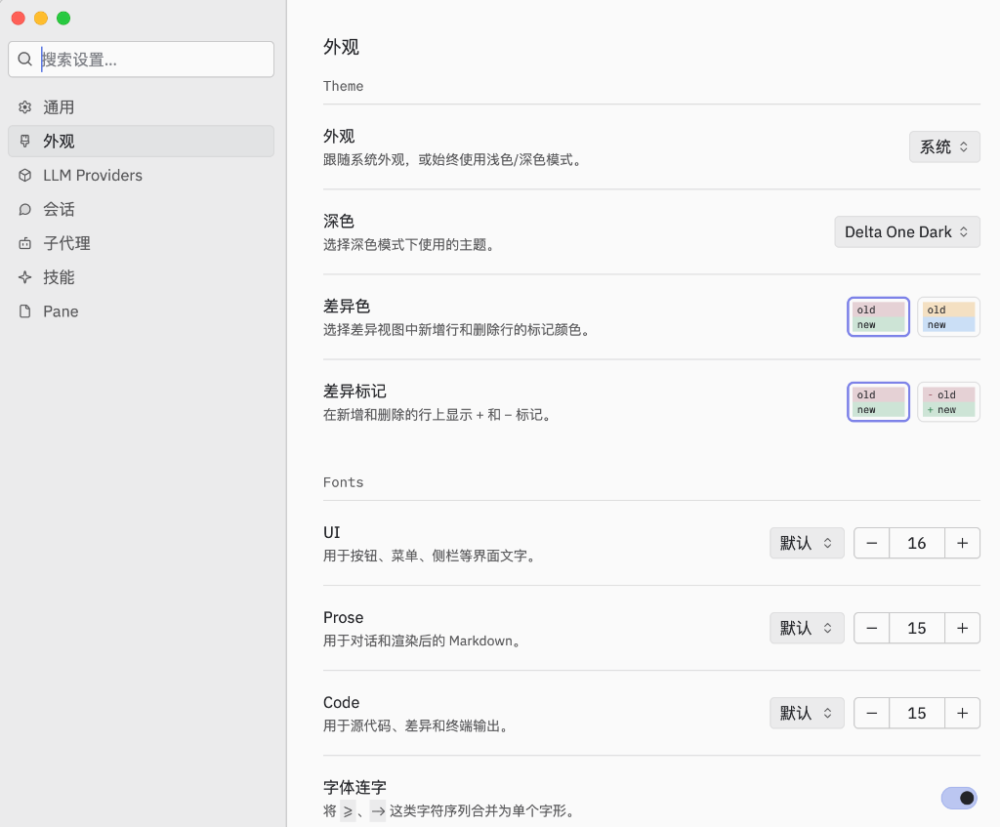
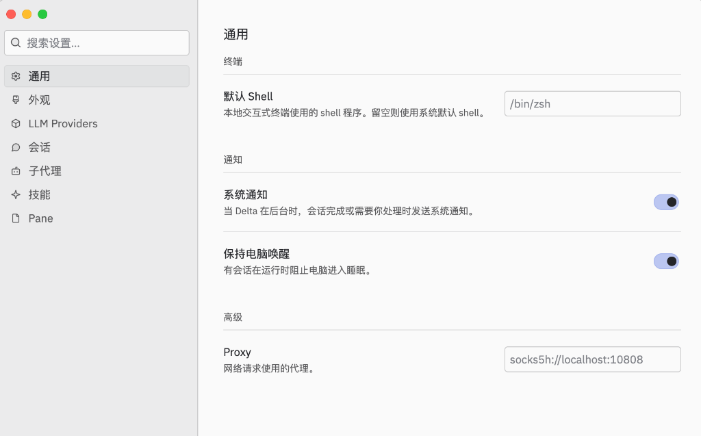

<h1 align="center">Delta 简体中文汉化包</h1>

<p align="center">面向 Zed Industries Delta (macOS arm64) 的二进制非侵入式简体中文语言补丁</p>

<p align="center">
  <a href="./LICENSE"></a>
  
  
  
</p>

Delta 是一款闭源的 macOS AI 编程 Agent 客户端。由于应用未提供官方语言包机制，界面文本直接硬编码编译在 Mach-O 主程序二进制中。

本项目通过反汇编解析 arm64 指令流与常量重定位表，实现精准的原位替换与安全内存搬迁，在完全不需要源码、不破坏核心功能的前提下，为 Delta 提供平滑自然的简体中文体验。

## 特性亮点

| 核心特性 | 技术支撑与实际收益 |
|---|---|
| 深度本地化覆盖 | 内置 1150+ 经过人工精校的中文词条，覆盖菜单、侧栏、全量设置页、命令面板及交互会话视图 |
| 非侵入式二进制补丁 | 仅对界面静态字符串与引用做精确补丁，不改动 Delta 网络传输、会话逻辑与 AI 协作机制 |
| 原位替换与安全搬迁 | 译文不长于原文时以零宽字符补齐对齐；译文更长时安全写入段尾对齐空洞并改写引用地址 |
| 自动备份与快速还原 | 执行补丁前自动备份原版二进制，提供一键还原命令，随时无损回到英文原版 |
| 权限自适应与重签名 | 自动处理 macOS 应用程序目录只读保护，补丁后自动生成 ad-hoc 代码签名保证平稳运行 |

## 架构与工作原理

补丁工具 `delta_i18n.py` 内部处理管道如下：

```text
┌──────────────────────────────────────────────────────────┐
│                      输入与准备                           │
│  ┌────────────────────────┐      ┌────────────────────┐  │
│  │ 原版 Delta.app (arm64) │      │ translations.json  │  │
│  │ (Mach-O 二进制文件)    │      │ (1150+ 校验词典)   │  │
│  └───────────┬────────────┘      └─────────┬──────────┘  │
└──────────────┼─────────────────────────────┼─────────────┘
               │ 自动备份至 ~/Library/...    │
               ▼                             ▼
┌──────────────────────────────────────────────────────────┐
│                   delta_i18n.py 核心引擎                  │
│                                                          │
│ 1. Mach-O 解析与符号扫描                                   │
│    ├── 指令级扫描: adrp + add (取地址), adrp + ldr (拷贝) │
│    └── 数据段扫描: __DATA_CONST chained fixups 胖指针    │
│                           │                              │
│                           ▼                              │
│ 2. 补丁注入策略判定                                       │
│    ├── 译文 <= 原文 ──▶ 原位替换 (零宽字符补齐 U+200B 等) │
│    └── 译文 > 原文  ──▶ 空间搬迁 (写入段尾对齐空洞/余量) │
│                           │                              │
│                           ▼                              │
│ 3. 引用改写与安全校验                                     │
│    └── 修正 adrp/add 立即数、movz 长度、(ptr, len) 胖指针 │
│                           │                              │
│                           ▼                              │
│ 4. 签名修复                                              │
│    └── codesign --sign - 重新生成 ad-hoc 签名            │
└───────────────────────────┬──────────────────────────────┘
                            │
                            ▼
               ┌────────────────────────┐
               │    汉化版 Delta.app    │
               │   (完整保留原生功能)   │
               └────────────────────────┘
```

1. **定位字符串**：扫描 `__TEXT,__text` 段中的 `adrp + add` 与 `adrp + ldr` 指令序列、附近计算长度的 `movz`，以及 `__DATA_CONST` 段中经 chained fixups 重定位的 `(ptr, len)` 胖指针，确定字面量的绝对物理偏移与读取长度。
2. **原位替换**：译文字节数不超过原文时直接原地覆写，不足字节用渲染不可见的零宽字符（U+200B / U+034F / U+E0001）补全，并执行 UTF-8 切断保护与内联立即数覆盖分析。
3. **空间搬迁**：译文字节数超出原文时，将其写入 Mach-O 头部余量及 `__TEXT` / `__DATA_CONST` 段末尾的对齐空洞（约 14 KB），并同步改写所有寄存器与胖指针引用。
4. **重新签名**：调用 `codesign --sign -` 重新执行 ad-hoc 签名，保持原有 entitlements 与硬化运行时一致。

## 效果展示

| 外观设置 | 通用设置 |
|---|---|
|  |  |

## 环境要求

- 操作系统：macOS（Apple Silicon / arm64 架构）
- 目标软件：已安装 [Delta.app](https://delta.dev)
- 运行环境：Python 3 及 numpy 库

## 快速安装

```bash
git clone https://github.com/245678000000/delta-zh-cn.git
cd delta-zh-cn
pip3 install -r requirements.txt
```

## 快速启动

1. 彻底退出正在运行的 Delta 应用程序。
2. 执行补丁应用命令：

```bash
python3 delta_i18n.py apply
```

3. 重新打开 Delta，即可进入中文界面。

如需还原为官方英文原版，执行：

```bash
python3 delta_i18n.py restore
```

## 常用命令

| 命令 | 说明 |
|---|---|
| `python3 delta_i18n.py apply` | 应用中文补丁，自动备份原版程序并完成重签名 |
| `python3 delta_i18n.py check` | 模拟检测模式，只输出可替换/无法替换词条报告，不修改任何文件 |
| `python3 delta_i18n.py restore` | 从备份目录恢复官方原版程序 |
| `python3 delta_i18n.py dump > strings.tsv` | 导出当前 Delta 二进制中所有可翻译的英文字符串至 TSV 文件 |

### Delta 自动更新后的处理

Delta 自动更新后，官方安装包会覆盖主程序并恢复为英文界面。此时只需重新执行：

```bash
python3 delta_i18n.py apply
```

工具采用动态指令扫描机制，不依赖固定内存地址，可适配后续多数常规小版本更新。

### macOS 权限说明

macOS 严格限制对 `/Applications` 中已安装 App 文件的直接就地写操作。当工具检测到权限不足时，会自动启用副本替换策略（复制 Delta.app 到临时目录打补丁后整包原子替换），无需手动调整系统 SIP 或文件权限。若启动时弹出 Gatekeeper 提示，在访达（Finder）中右键点击 Delta.app 并选择"打开"即可。

## 已知限制

- **极短词汇保留英文**：4 至 5 字节的极短单词（如 `Pane`、`Code`、`Theme`、`Copy`、`Proxy`），因中文单字需占用 3 字节 UTF-8 编码，无法在严格受限的字节长度内完成原位替换，且其汇编引用形式无法安全搬迁，此类词汇会保持英文显示。
- **运行时动态拼接文本**：命令面板中的部分动作（例如 `Edit Global Rules`、`Send Comment`）为运行时根据 Action Identifier 动态拼装生成，二进制中不存在完整静态字符串，无法通过静态补丁修改。
- **多重引用冲突词条**：若某一词条在二进制中存在多处实例，且其中某处引用被判定为搬迁不安全，为保证程序稳定将放弃对该处进行替换。
- **架构支持**：目前仅支持 macOS arm64 架构二进制。

## 参与维护与词典贡献

词典保存在 `translations.json`，结构为扁平的 `{"英文原文": "中文翻译"}` 映射表。键名必须与二进制中的提取内容完全一致。

1. 导出最新版本的待翻译词条：

```bash
python3 delta_i18n.py dump > strings.tsv
```

2. 编辑更新 `translations.json` 后，使用测试模式验证兼容性：

```bash
python3 delta_i18n.py check
```

3. 验证无误后提交 Pull Request。

### 核心术语对照表

| 英文原词 | 推荐译名 |
|---|---|
| Thread | 会话 |
| Subagent | 子代理 |
| Worktree | 工作树 |
| Runner | 运行器 |
| Review | 审查 |
| Pane | 窗格 |
| Command Palette | 命令面板 |
| Profile | 配置档案 |
| Compaction | 压缩上下文 |
| Checkout | 检出目录 |

## Star History

[](https://star-history.com/#245678000000/delta-zh-cn&Date)

## 开源协议与声明

- 本项目的工具脚本与词典文件采用 [MIT License](./LICENSE) 授权。
- Delta 商标及客户端所有权归 Zed Industries 所有。本项目为第三方开源语言补丁，不包含、不分发任何 Delta 原始二进制文件。
